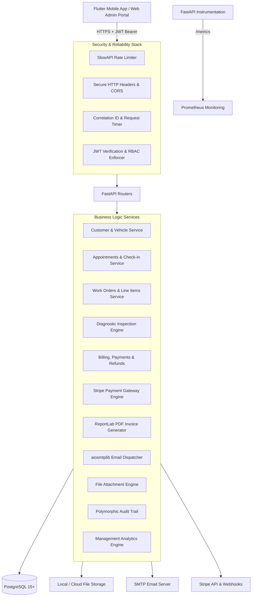

# 🚗 Vehicle Service Shop API

An enterprise-grade, asynchronous REST API for full auto repair shop management built with **FastAPI**, **SQLAlchemy 2.0 (Asyncpg)**, and **PostgreSQL**.

The platform powers customer onboarding, appointments, multi-point diagnostic inspections, job work orders, parts inventory procurement, financial billing, PDF invoice generation, async email notifications, file attachments, polymorphic audit logging, and **Stripe online payment processing**.

---

## 🏗️ System Architecture



---

## ✨ Features Breakdown

### 📋 Phase 1: Receptionist & Customer Onboarding
- **Comprehensive Customer Profiles**: Stores primary/secondary phone numbers, email, billing addresses, tax exemption flags, and notes.
- **Advanced Search**: Multi-field search across customers (name, email, phone) and vehicles (VIN, license plate, make, model).
- **Vehicle Identification**: VIN (17-char normalized) and license plate tracking.
- **Configurable Tax Engine**: Dynamic tax rates and labels applied at checkout.

### 📊 Phase 2: Manager Business Operations & Financials
- **Executive Reporting & Analytics**:
  - Daily revenue breakdown by payment method (cash, card, check, insurance, Stripe).
  - Accounts Receivable (AR) aging report with days outstanding.
  - Technician productivity tracking (labor hours billed vs completed).
- **Professional PDF Generation**: Clean, branded PDF generation for Quotes and Invoices via ReportLab.
- **Refund Processing**: Full and partial refunds for payments and deposits with audit logging.
- **Vehicle Service History**: Complete timeline of all past visits, work orders, line items, and expenditures for any vehicle.
- **Canned Service Menu**: Pre-configured service packages (e.g., Synthetic Oil Change, Brake Service) for one-click quote generation.

### 🌐 Phase 3: Remote Customer Interaction & Governance
- **Asynchronous Email Notifications**: Templated email triggers for quote approvals, vehicle ready notifications, and appointment reminders.
- **Self-Service & Admin User Management**: Secure bcrypt token-based password reset flows with expiration windows.
- **File Attachment Engine**: Multi-entity file attachments (inspection photos, documents, invoices) with MIME validation and disk persistence.
- **Polymorphic Audit Trail**: Comprehensive change-tracking for all sensitive entity mutations (actor ID, username, action, and JSON diffs).

### 💳 Stripe Payment Gateway Integration
- **Stripe Checkout Sessions**: Hosted checkout pages for online invoice settlement (`POST /invoices/{id}/pay`).
- **Cryptographic Webhook Processing**: Verified event handler (`POST /stripe/webhook`) for `checkout.session.completed` with automatic invoice payment resolution and idempotency protection.
- **Online Processor Refunds**: Automatic Stripe refunds when refunding card payments via `POST /payments/{id}/refund`.
- **Live Status Inspection**: Real-time PaymentIntent status checking via `GET /payments/{id}/stripe-status`.
- **Zero-Disruption Fallback**: Manual payments (cash, check, insurance) remain fully supported when Stripe is disabled.

### 🛡️ Phase 4: Production Hardening & Polish
- **Graceful Application Lifespan**: Modern FastAPI `lifespan` context manager verifying database readiness and upload storage on boot.
- **Connection Pool Tuning**: Queue pool with `pool_pre_ping=True`, automatic connection recycling, and pool size configuration.
- **Strict Input Validation**: Pydantic models with email validation, phone sanitization, plate normalization, and non-negative boundaries (`ge=0`).
- **Idempotent Database Seeding**: Automated seeding for admin users, bays, technicians, parts catalog, and standard service menu packages.
- **Observability**: Prometheus metrics export via `/metrics` and structured JSON request logging.

---

## 👥 Role-Based Access Control (RBAC)

| Role | Permissions & Scope |
| :--- | :--- |
| **`manager`** | Full administrative access: view financial reports, manage employees & bays, issue refunds, edit shop configuration. |
| **`advisor`** | Create customers/vehicles, book appointments, build quotes, assign work orders, collect payments, and upload files. |
| **`technician`** | Conduct diagnostic inspections, log labor hours, mark line items in-progress/completed, view assigned bays. |
| **`customer`** | View own vehicle history, view approved quotes, check invoice status, pay invoices via Stripe Checkout, request appointments. |

---

## ⚙️ Configuration Reference (`.env`)

| Variable | Type | Default | Description |
| :--- | :--- | :--- | :--- |
| `APP_NAME` | `str` | `"Vehicle Service Shop API"` | Name of the application instance |
| `ENVIRONMENT` | `str` | `"development"` | `development`, `testing`, `staging`, or `production` |
| `DEBUG` | `bool` | `False` | Enable SQLAlchemy query debug printing |
| `LOG_LEVEL` | `str` | `"INFO"` | Logging level (`DEBUG`, `INFO`, `WARNING`, `ERROR`) |
| `DATABASE_URL` | `str` | *PostgreSQL URL* | Async connection string (`postgresql+asyncpg://...`) |
| `DB_POOL_SIZE` | `int` | `5` | Base connection pool size |
| `DB_MAX_OVERFLOW` | `int` | `10` | Max overflow connections beyond pool size |
| `DB_POOL_RECYCLE` | `int` | `1800` | Connection recycle timeout in seconds |
| `SECRET_KEY` | `str` | *Required* | Secret key for JWT cryptographic signing |
| `ACCESS_TOKEN_EXPIRE_MINUTES` | `int` | `15` | Expiration lifetime for access tokens |
| `REFRESH_TOKEN_EXPIRE_DAYS` | `int` | `7` | Expiration lifetime for refresh tokens |
| `RATE_LIMIT_AUTH` | `int` | `10` | Rate limit for authentication requests per minute |
| `CORS_ORIGINS` | `str` | `"http://localhost:3000"` | Comma-separated list of allowed origins |
| `SHOP_NAME` | `str` | `"Auto Service Shop"` | Shop name displayed on PDF invoices |
| `SHOP_ADDRESS` | `str` | `"123 Main Street..."` | Shop address displayed on PDF invoices |
| `SHOP_PHONE` | `str` | `"(555) 555-0100"` | Shop phone displayed on PDF invoices |
| `TAX_RATE` | `float` | `0.07` | Default tax rate applied to billing (7%) |
| `TAX_LABEL` | `str` | `"Sales Tax"` | Label printed on receipts and invoices |
| `EMAIL_ENABLED` | `bool` | `False` | Enable live SMTP email dispatch |
| `SMTP_HOST` | `str` | `"localhost"` | SMTP server hostname |
| `SMTP_PORT` | `int` | `587` | SMTP server port |
| `UPLOAD_DIR` | `str` | `"uploads"` | Local filesystem directory for file storage |
| `MAX_FILE_SIZE_MB` | `int` | `10` | Max allowed file size for uploads in MB |
| `STRIPE_ENABLED` | `bool` | `False` | Enable Stripe payment gateway processing |
| `STRIPE_SECRET_KEY` | `str` | `""` | Stripe secret API key (`sk_test_...` or `sk_live_...`) |
| `STRIPE_PUBLISHABLE_KEY` | `str` | `""` | Stripe publishable key (`pk_test_...` or `pk_live_...`) |
| `STRIPE_WEBHOOK_SECRET` | `str` | `""` | Stripe webhook signing secret (`whsec_...`) |
| `STRIPE_SUCCESS_URL` | `str` | `".../payment/success"` | Client redirect URL upon successful checkout |
| `STRIPE_CANCEL_URL` | `str` | `".../payment/cancel"` | Client redirect URL if checkout is cancelled |

---

## 🚀 Getting Started

### Prerequisites
- **Python 3.12+**
- **PostgreSQL 15+** (or Docker)

### Option A: Running with Docker Compose (Recommended)

1. Clone the repository:
   ```bash
   git clone https://github.com/Affan1316/vehicle-service-shop-api.git
   cd vehicle-service-shop-api
   ```

2. Copy the environment configuration:
   ```bash
   cp .env.example .env
   ```

3. Launch the full stack (API, PostgreSQL, Prometheus):
   ```bash
   docker compose up -d --build
   ```

4. The server is ready at `http://localhost:8000`.

---

### Option B: Running Locally

1. **Create and activate a virtual environment**:
   ```bash
   python -m venv .venv
   # Windows:
   .venv\Scripts\activate
   # Linux/macOS:
   source .venv/bin/activate
   ```

2. **Install dependencies**:
   ```bash
   pip install -r requirements-dev.txt
   ```

3. **Configure Environment**:
   ```bash
   cp .env.example .env
   # Edit .env to set your PostgreSQL credentials and SECRET_KEY
   ```

4. **Apply Database Migrations**:
   ```bash
   alembic upgrade head
   ```

5. **Seed Baseline Data** (creates default admin user, bays, technicians, and parts):
   ```bash
   python seed_db.py
   ```

6. **Start Application Server**:
   ```bash
   uvicorn app.main:app --reload --port 8000
   ```

---

## 🧪 Testing & Linting

### Run Test Suite
Run the 50 comprehensive integration and unit tests:
```bash
pytest
```

### Run Linter
Verify code style and formatting using Ruff:
```bash
ruff check app/ tests/
```

---

## 📖 API Documentation & Endpoints

Once the application is running, visit:
- **Swagger UI Interactive Docs**: [http://localhost:8000/docs](http://localhost:8000/docs)
- **ReDoc Alternative Docs**: [http://localhost:8000/redoc](http://localhost:8000/redoc)
- **Health Check Probe**: [http://localhost:8000/health](http://localhost:8000/health)
- **Prometheus Metrics**: [http://localhost:8000/metrics](http://localhost:8000/metrics)
